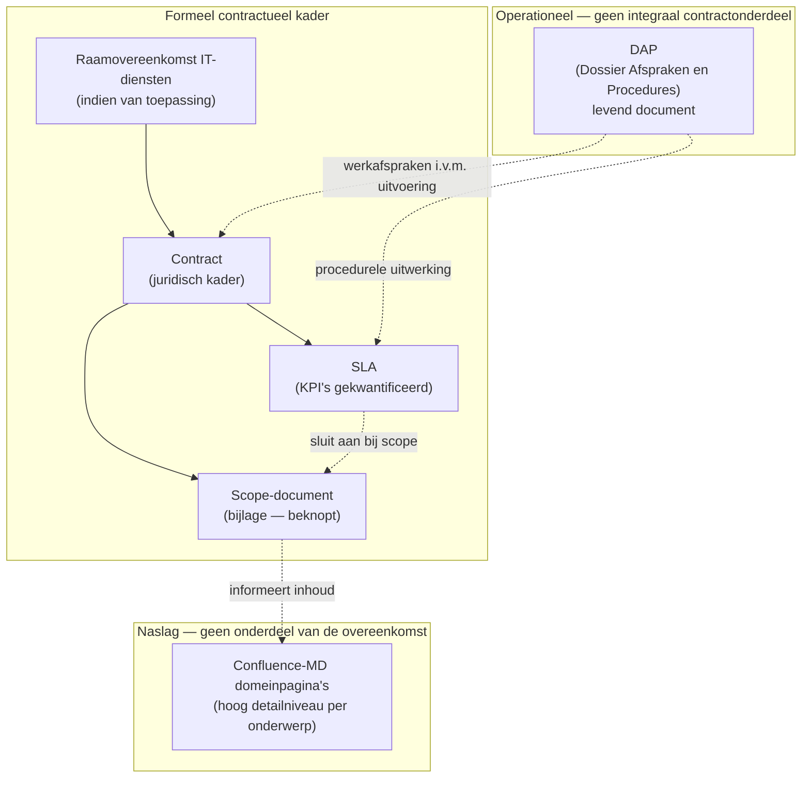

# Documentstructuur — Managed Services

Dit document beschrijft hoe de **formele overeenkomst**, **scope**, **SLA**, het **DAP** en de **Confluence-markdownnaslag** zich tot elkaar verhouden. Gebruik dit als vaste uitleg bij onboardings, juridische vragen of het bijwerken van templates.

---

## Samenvatting in één zin

Het **contract** kader juridisch af; de **scope-bijlage** bevat de beknopte, contractuele uitwerking van wat wordt geleverd; de **SLA** kwantificeert prestaties; het **DAP** is een **levend** werkdossier voor de uitvoering; de **Confluence-MD-pagina's** zijn **naslag** met hoog detailniveau en maken **geen deel uit** van de overeenkomst.

---

## Visueel overzicht

---

## Laag per laag

### 1. Contract

**Doel:** Juridische afbakening — partijen, looptijd, opzegging, prijs, algemene rechten en plichten, aansprakelijkheid, vertrouwelijkheid, enzovoort.

**Kenmerken:**

- Ondertekend / uitdrukkelijk aanvaard waar dat nodig is.
- Verwijst naar bijlagen voor scope en SLA waar die onderdeel van het contractuele pakket zijn.

---

### 2. Scope-document (bijlage bij het contract)

**Doel:** **Contractuele** uitwerking van *wat* in de dienstverlening valt: welke **diensten** en **onderdelen** worden geleverd, in **beknopte** vorm.

**Kenmerken:**

- Één overzichtelijk document (bijlage) dat past bij het contract.
- Inhoudelijk gebaseerd op dezelfde thema's als de uitgebreide Confluence-beschrijvingen, maar **niet** gelijk aan die pagina's — het is de **samengevatte scope**, geschikt voor juridische en commerciële helderheid.
- Wat **niet** in deze bijlage staat, valt — tenzij elders expliciet in het contract opgenomen — **niet** onder de overeengekomen levering.

**Relatie tot andere documenten:**

- Onderliggende **verdieping** en rationale vind je in de Confluence-MD-naslag (zie hieronder).
- De **SLA** sluit aan op deze scope: KPI's hebben alleen zin voor onderdelen die binnen scope vallen.

---

### 3. SLA (Service Level Agreement)

**Doel:** **Meetbare** afspraken — reactietijden, oppaktijden, beschikbaarheid, toleranties, compensatieregels, enzovoort.

**Kenmerken:**

- Maakt onderdeel uit van het **formele kader** (rangorde en juridische verwijzingen zoals overeengekomen).
- **Kwantificeert** kwaliteit; beschrijft niet alle werkprocessen in operationeel detail — dat blijft bij het DAP en naslag.

---

### 4. DAP (Dossier Afspraken en Procedures)

**Doel:** Praktische **uitvoering** van de samenwerking: contactpersonen, werkwijzen, escalatie, procesflows, rapportagemomenten, enzovoort.

**Kenmerken:**

- **Levend document:** wordt in **onderling overleg** tussen Opdrachtgever en iO bijgewerkt en geoptimaliseerd naarmate de situatie verandert.
- **Geen integraal onderdeel van de overeenkomst** — het hoeft dus niet als vaste bijlage met dezelfde juridische status als scope of SLA te worden beschouwd.
- **Wel essentieel voor de dagelijkse praktijk:** het ondersteunt naleving van afspraken en maakt verwachtingen expliciet zonder dat elke wijziging een contractwijziging hoeft te zijn (tenzij Partijen iets anders vastleggen).

**Tip bij teksten:** In contracttemplates kun je het DAP omschrijven als *operationeel dossier* waarnaar Partijen zich committeren om het actueel te houden, in plaats van het als statische contractbijlage op te nemen.

---

### 5. Confluence-markdownpagina's (`Confluence_Domeinpagina_*.md`, enz.)

**Doel:** **Naslag** en **diepe uitleg** per domein (Service Desk, Monitoring, Cloud, enzovoort).

**Kenmerken:**

- Hoog **detailniveau** — geschikt voor teams, training en FAQ.
- **Geen formeel onderdeel** van de overeenkomst: bij geschillen of interpretatie leidt het contract met bijlagen (scope, SLA) en niet deze naslagwerken (tenzij expliciet anders vastgelegd).

**Relatie tot het scope-document:**

- De scope-bijlage is de **beknopte vertaling** van deze inhoud naar wat contractueel relevant is.
- De MD-pagina's blijven de **bron voor volledigheid** en actualisering van kennis; wijzigingen daar hoeven niet automatisch scope of SLA te wijzigen — alleen als Partijen besluiten dat de **contractuele** levering mee verandert.

---

## Rangorde en tegenstrijdigheid (richtlijn)

Typisch geldt bij **tegenstrijdigheid** tussen *formele* stukken:

1. Raamovereenkomst (indien van toepassing)
2. Contract
3. Scope-bijlage
4. SLA

Het **DAP** en de **Confluence-MD** documenten vallen **buiten** deze rangorde voor zover ze niet uitdrukkelijk als leidend zijn opgenomen — ze **ondersteunen** uitvoering en begrip.

*(Pas concrete rangorde altijd aan op wat juridisch is vastgelegd in jullie definitieve contractversie.)*

---

## Wanneer wat bijwerken?

| Situatie | Waar pas je typisch wat aan? |
| --- | --- |
| Nieuwe KPI of gewijzigde norm | SLA (+ evt. scope als het onderdeel nieuw is) |
| Nieuwe dienst of onderdeel in levering | Scope-bijlage (+ contract als juridisch nodig) |
| Andere contactpersoon of werkproces | DAP |
| Uitgebreidere uitleg voor intern / klant zonder contractimpact | Confluence-MD |

---

## Referentie naar bestanden in deze repository

| Rol | Voorbeelden / locatie |
| --- | --- |
| Contract (concept) | `Juridisch_Contract_Managed_Services.md` |
| Bijlage A — Scope | `Bijlage_Scope_Managed_Services.md` |
| Bijlage B — SLA | `SLA_Standaard.md` |
| Bijlage C — URLs / infra | `Bijlage_C_Componenten_URLs_en_infrastructuur.md` |
| Bijlage D — Prijs | `Bijlage_D_Prijs_en_facturatie.md` |
| Begrippenlijst (bijlage E) | Opgenomen in `Juridisch_Contract_Managed_Services.md` |
| ~~Beheerovereenkomst~~ *(vervallen — verwijs naar bovenstaande)* | `Beheerovereenkomst.md` bevat alleen nog een doorverwijs |
| Dienstbeschrijvingen (naslag) | `Applicatie_Dienstverlening.md`, `Cloud_Dienstverlening.md`, `Confluence_Domeinpagina_*.md` |

---

*Versie: intern referentiekader — werk bij wanneer jullie templatekeuzes of juridische positie veranderen.*
