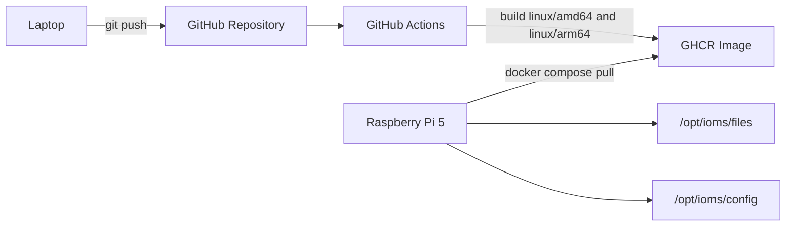

# iOMS op Raspberry Pi 5 via GitHub Container Registry

Deze deployroute is GitHub-first:

1. Code staat in GitHub.
2. GitHub Actions bouwt een multi-arch Docker image voor `linux/amd64` en `linux/arm64`.
3. De Raspberry Pi 5 pullt de ARM64 image uit GitHub Container Registry.
4. De Pi draait iOMS met `docker compose`, met lokale data en secrets buiten de image.

## Architectuur



## Bestanden

- Workflow: `.github/workflows/docker-image.yml`
- Pi compose: `markdown-viewer/docker-compose.pi.yml`
- Pi env-template: `markdown-viewer/.env.pi.example`
- Dockerfile: `markdown-viewer/Dockerfile`

## Stap 1: GitHub repository koppelen

Deze lokale repo heeft mogelijk nog geen remote. Maak eerst een GitHub repository aan, bijvoorbeeld `iOMS`.

Voeg daarna lokaal de remote toe:

```powershell
git remote add origin https://github.com/<OWNER>/<REPO>.git
git push -u origin HEAD
```

Gebruik in de voorbeelden hieronder de lowercase vorm van owner/repo.

## Stap 2: GitHub Actions image build

De workflow publiceert naar:

```text
ghcr.io/<owner>/<repo>/ioms-markdown-viewer:latest
```

De workflow draait automatisch op push naar `main` of `master`, en handmatig via `workflow_dispatch`.

Als je huidige branch nog geen `main` of `master` is, kun je:

```powershell
git checkout -b main
git push -u origin main
```

Of in GitHub Actions handmatig de workflow starten op de gewenste branch.

## Stap 3: GHCR package rechten

Voor private repositories kan de Pi alleen pullen met een GitHub Personal Access Token.

Maak een token met minimaal:

- `read:packages`

Log op de Pi in:

```bash
echo "GHCR_TOKEN_HIER" | docker login ghcr.io -u GITHUB_GEBRUIKER --password-stdin
```

Voor publieke package visibility is login vaak niet nodig, maar voor privégebruik is login aanbevolen.

## Stap 4: Pi voorbereiden

Op de Raspberry Pi:

```bash
sudo apt update
sudo apt install -y ca-certificates curl git
```

Installeer Docker volgens de officiële Docker-instructies of via:

```bash
curl -fsSL https://get.docker.com | sh
sudo usermod -aG docker "$USER"
```

Log daarna opnieuw in op de Pi, of herstart de sessie.

Controleer:

```bash
docker version
docker compose version
```

Maak de iOMS-mappen:

```bash
sudo mkdir -p /opt/ioms/app /opt/ioms/files /opt/ioms/config
sudo chown -R "$USER:$USER" /opt/ioms
```

## Stap 5: Compose en env op de Pi zetten

Optie A: clone de repository op de Pi:

```bash
cd /opt/ioms/app
git clone https://github.com/<OWNER>/<REPO>.git .
cd markdown-viewer
```

Optie B: kopieer alleen deze bestanden naar `/opt/ioms/app/markdown-viewer`:

- `docker-compose.pi.yml`
- `.env.pi.example`

Maak `.env.pi`:

```bash
cp .env.pi.example .env.pi
nano .env.pi
```

Vul minimaal:

```env
IOMS_IMAGE=ghcr.io/<owner>/<repo>/ioms-markdown-viewer:latest
IOMS_AUTH_USER=joost
IOMS_AUTH_PASSWORD=een-sterk-wachtwoord
AGENT_API_KEY=...
AGENT_ENDPOINT=...
AGENT_MODEL=...
```

Optioneel:

```env
TAVILY_API_KEY=...
CONFLUENCE_BASE_URL=...
CONFLUENCE_PAT=...
```

## Stap 6: Data overzetten

Vanaf je laptop kun je `Files` naar de Pi kopiëren. Pas host/user aan wanneer je die weet:

```powershell
scp -r c:\Users\joost.vanleeuwaarden\webroot\iOMS\Files\* pi@raspberrypi.local:/opt/ioms/files/
```

Als de SSH trust al werkt, kun je dezelfde route gebruiken met de juiste hostname of IP.

Let op: `.memory`, `.reviews` en `.mv-index` staan onder `Files` en gaan mee als je de hele map kopieert.

## Stap 7: Starten op de Pi

Op de Pi, vanuit de map met `docker-compose.pi.yml`:

```bash
docker compose --env-file .env.pi -f docker-compose.pi.yml pull
docker compose --env-file .env.pi -f docker-compose.pi.yml up -d
```

Controleer:

```bash
docker compose --env-file .env.pi -f docker-compose.pi.yml ps
docker compose --env-file .env.pi -f docker-compose.pi.yml logs -f app
```

Open in je browser:

```text
http://<pi-ip>:8787
```

Log in met `IOMS_AUTH_USER` en `IOMS_AUTH_PASSWORD`.

## Updates uitvoeren

Laptop:

```powershell
git add .
git commit -m "Update iOMS"
git push
```

Wacht tot GitHub Actions klaar is.

Pi:

```bash
cd /opt/ioms/app/markdown-viewer
git pull
docker compose --env-file .env.pi -f docker-compose.pi.yml pull
docker compose --env-file .env.pi -f docker-compose.pi.yml up -d
```

Als je alleen compose/env-bestanden op de Pi hebt staan en geen volledige clone gebruikt:

```bash
docker compose --env-file .env.pi -f docker-compose.pi.yml pull
docker compose --env-file .env.pi -f docker-compose.pi.yml up -d
```

## Backup

Maak regelmatig backup van:

- `/opt/ioms/files`
- `/opt/ioms/config`

Voorbeeld:

```bash
tar -czf "$HOME/ioms-backup-$(date +%F).tgz" /opt/ioms/files /opt/ioms/config
```

## Word-export

Zet `DOCX_EXPORT_URL` alleen naar `127.0.0.1` als de Word-export service op dezelfde Pi draait.

Voor een service elders in je netwerk:

```env
DOCX_EXPORT_URL=http://<host-ip>:8080
DOCX_EXPORT_STYLE=portal
DOCX_EXPORT_TOKEN=...
```

## Latere uitbreiding: automatische deploy

De eerste versie is bewust pull-based. Een volgende stap kan zijn:

- self-hosted GitHub runner op de Pi;
- GitHub Action die na build automatisch `docker compose pull && up -d` uitvoert;
- of SSH deploy vanuit GitHub Actions naar de Pi.

Voor nu is handmatig pullen eenvoudiger, transparanter en minder kwetsbaar.
